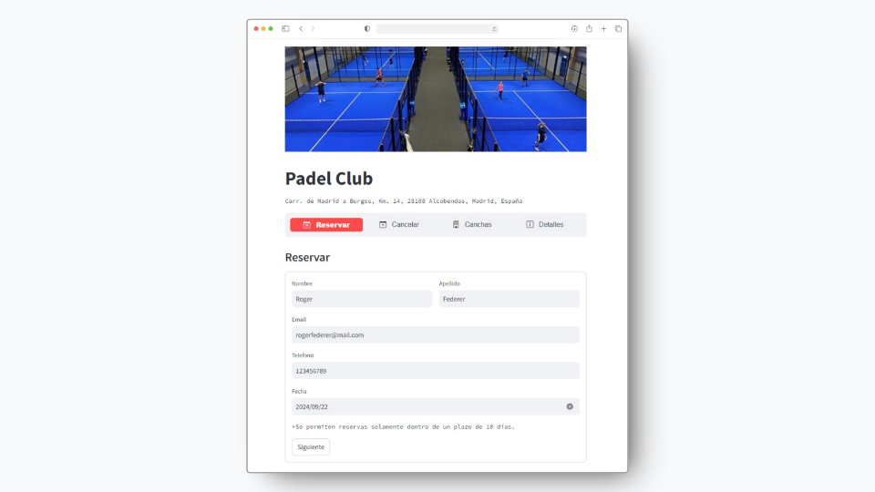
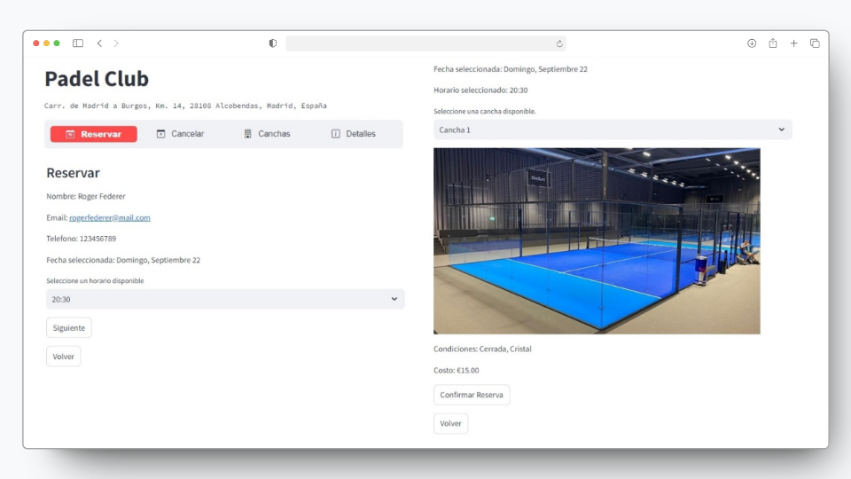
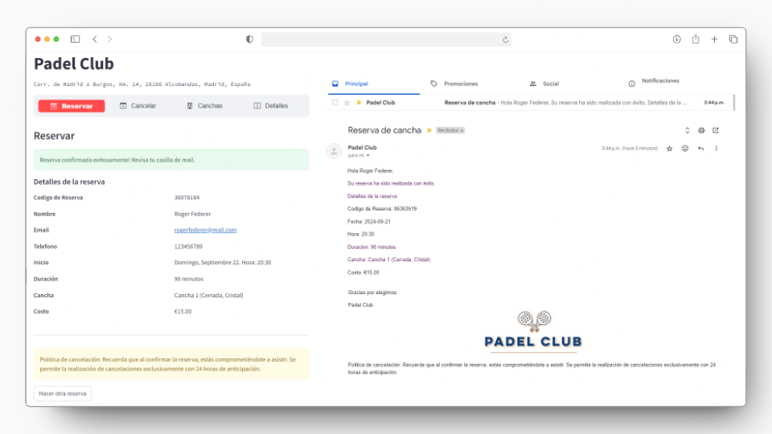
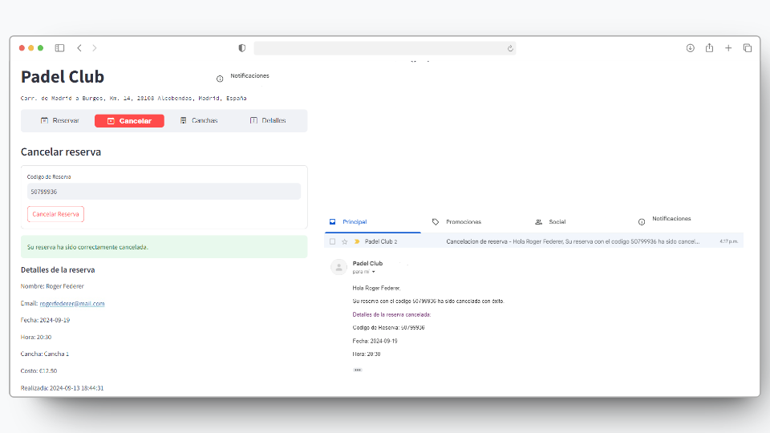
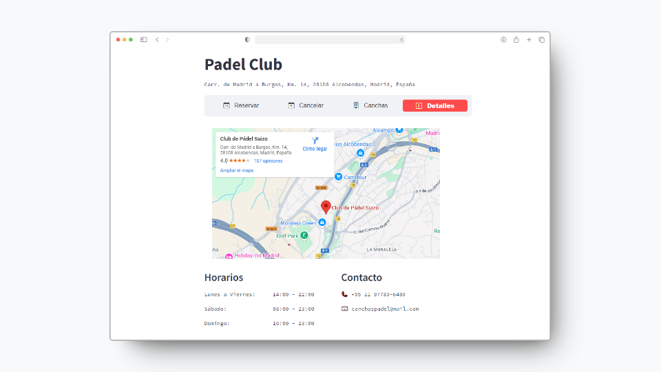

# Padel Club - Online Court Reservation App



Check out the application [here](https://padelclub-reservaonline.streamlit.app/).

## Overview

Padel Club is a web application designed for managing court reservations at a padel club. Built with Python and Streamlit, this application allows users to book and cancel court reservations online. It integrates with a MongoDB database to store reservation details and utilizes email for sending confirmation and cancellation notifications.

## Features

- **Court Reservation**: Users can choose from available dates, times, and courts, and then confirm their reservations.
- **Reservation Cancellation**: Users can cancel their reservations using a unique reservation code.
- **Email Notifications**: Users receive email confirmations upon successful bookings and cancellation notifications upon request.
- **Database Integration**: All reservation details are stored in a MongoDB database for persistence.

## Technologies Used

- **Python**: The primary programming language for backend logic.
- **Streamlit**: A framework for creating interactive web applications.
- **MongoDB**: A NoSQL database for storing reservation data.
- **SMTP**: For sending email notifications.
- **Streamlit Option Menu**: For a user-friendly interface with navigable options.

## Implementation Details

### Frontend

The application uses Streamlit to create an intuitive web interface. The main features include:

- **Reservation Form**: Collects user details, date, time, and court preferences.
- **Cancellation Form**: Allows users to cancel reservations using a unique code.
- **Court Details Page**: Displays information about different courts, including images, conditions, and costs.
- **Contact Information**: Provides contact details for users to reach out for any queries.

### Backend

- **Database**: MongoDB is used to manage and store reservation data. The application connects to MongoDB using the `pymongo` library.
- **Email Sending**: Email notifications are managed through an SMTP server. The `send_email` function constructs and sends HTML-formatted emails.

### Screenshots

**Reservation:**





**Cancellation:**



**Club Details Page:**



## How It Works

1. **Reservation Process**:
   - Users enter their personal information and select a date.
   - They choose an available time slot and court.
   - The reservation is confirmed, and a unique code is generated.
   - Users receive an email with the reservation details.

2. **Cancellation Process**:
   - Users enter their reservation code.
   - The system verifies and cancels the reservation if valid.
   - A cancellation email is sent to the user.

## Requirements

- `streamlit`
- `streamlit-option-menu`
- `secure-smtplib`
- `pymongo`

## Installation

To install the required packages, use the following command:

```bash
pip install streamlit streamlit-option-menu secure-smtplib pymongo
